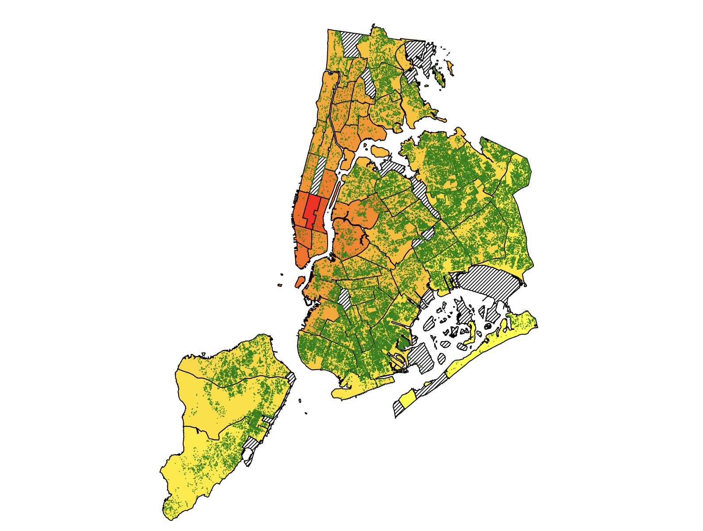

# NYTrees

Used d3.js to analyze the distirubition of trees in New York. Analyzed different effects the trees have with the community in New York.

To interact with the d3.js application, run a server in the NYTrees working directory. You can create a simple python server 
if you have python installed.

Run 
```
python -m http.server
```
in the NYTrees workign directory and load up the index.html page.

Simply zoom in and out and pan on the graphs to look at the distribution in depth. The relationship between poverty,
air quality(measured with air particle) and also tree distribution.



Each green circle on the map represents an individual tree. The map is colored according to the air particles in the corresponding community district.
